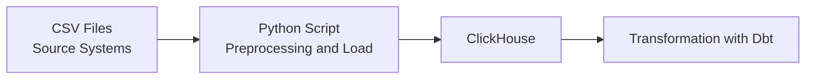
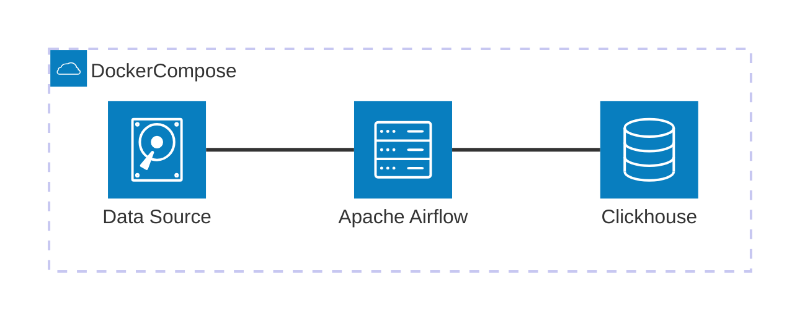
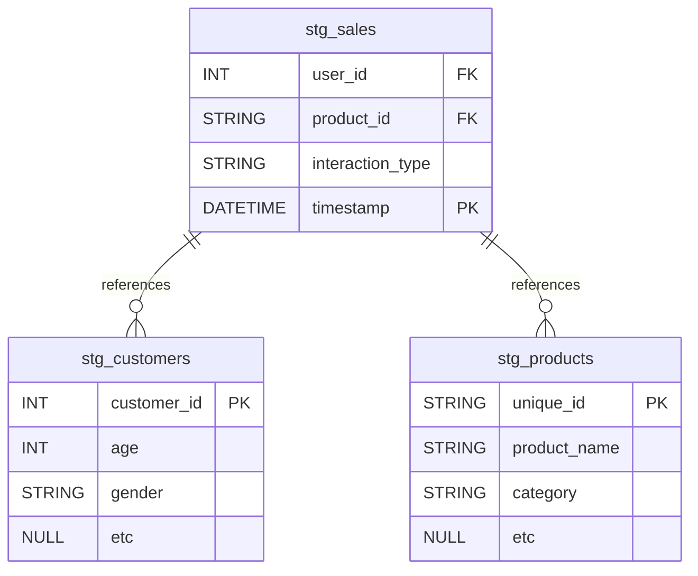

# Development and Optimization of an ETL Pipeline for E-commerce Sales Data

#### Author: Gabriel Vieri

This document outlines the ETL (Extract, Transform, Load) process designed to ingest and transform data from raw source files into a structured format within the data warehouse. It includes details on data sources, transformation logic, pipeline architecture, schema in the data warehouse, and how to deploy & maintain pipeline.


### Data Pipeline Architecture




### Data Sources

| Source Name | Type      |  Location                               |
| ----------- | --------- |  ---------------------------------------|
| Sales       | CSV file  |  /data/E-commerece sales data 2024.csv  |
| Customers   | CSV file  |  /data/customer_details.csv             |
| Products    | CSV file  |  /data/product_details.csv              |

### Preprocessing Logic
- Standardize column names
- Convert date strings to standard format datetimes
- Convert numerical strings to integers/floats
- Fill missing values where applicable

### Data Warehouse Schema


### Dbt Transformation Logic


### Airflow DAG Configuration
1. DAG Name: dag_ecommerce
    - Schedule: @hourly
    - Retry Policy: 3 retries with 5-minute delay
    - Task: ingest_data (calls etl.py)
2. DAG Name: dbt_warehouse_models
    - Schedule: 30 * * * *
    - Retry Policy: 1 retries with 5-minute delay
    - Task: dbt_staging >> dbt_marts >> dbt_test

### Testing & Monitoring
- Docker healthchecks for PostgreSQL availability
- Logging via Airflow task logs
- Manual test run using:
docker exec -it airflow-worker python /opt/airflow/dags/scripts/etl.py

### Notes
ETL can be re-run without duplicate inserts (uses truncates tables)

### Docker Compose Services Overview
- postgres: Metadata store for Airflow
- clickhouse: Database to store ingested data and behaves as analytics databases
- airflow-webserver: UI for managing DAGs and tasks
- airflow-scheduler: Triggers tasks at scheduled intervals
- python-dev: Jupyter Notebook for development purposes inside Docker

### Docker Volumes
- postgres_data: Stores PostgreSQL database files
- airflow_logs: Stores Airflow task logs 
- clickhouse_data: Stores database files for data warehouse
- ./airflow/dags: Stores DAG definitions and scripts
- ./data: Stores source data
- ./python-dev/: Stores testing script for Jupyter Notebook
- ./dbt: Stores dbt configuration

### Startup Commands
```
docker-compose up -d --build
```

### Deployment & Maintenance Guide
#### Setup & Prerequisites
- Tools:
    - Docker
    - Git: for version control
- Requirements
    - A configured dbt project with working profiles.yml
    - Connection to ClickHouse verified
    - Models and sources defined and tested locally

#### Testing the Pipeline Before production
##### For Extract-Load
- Use Jupyter Notebook to test python script inside Docker environment
##### For Transformation
- Run dbt debug to verifies connection and config.
- Run dbt build to runs models and tests.
- Use dbt docs generate && dbt docs serve to check documentation.

#### Deploying the Pipeline
##### For Extract-Load
- Place python scripts in /dags/scripts folder
- Place DAG file in /dags folder and wait until Airflow recognized new files
##### For Transformation
- Place sql file in /models folder according to section whether for staging or marts

#### Maintenance Best Practices 
##### Daily:
- Monitor Airflow DAG status
- Check dbt model freshness using dbt source freshness
- Review data test failures in Airflow logs
##### Weekly:
- Update dbt docs generate and store artifacts
- Run full dbt build and validate model outputs
##### Monthly:
- Refactor or optimize long-running models
- Review unused columns/tables
- Refresh dbt snapshots if used